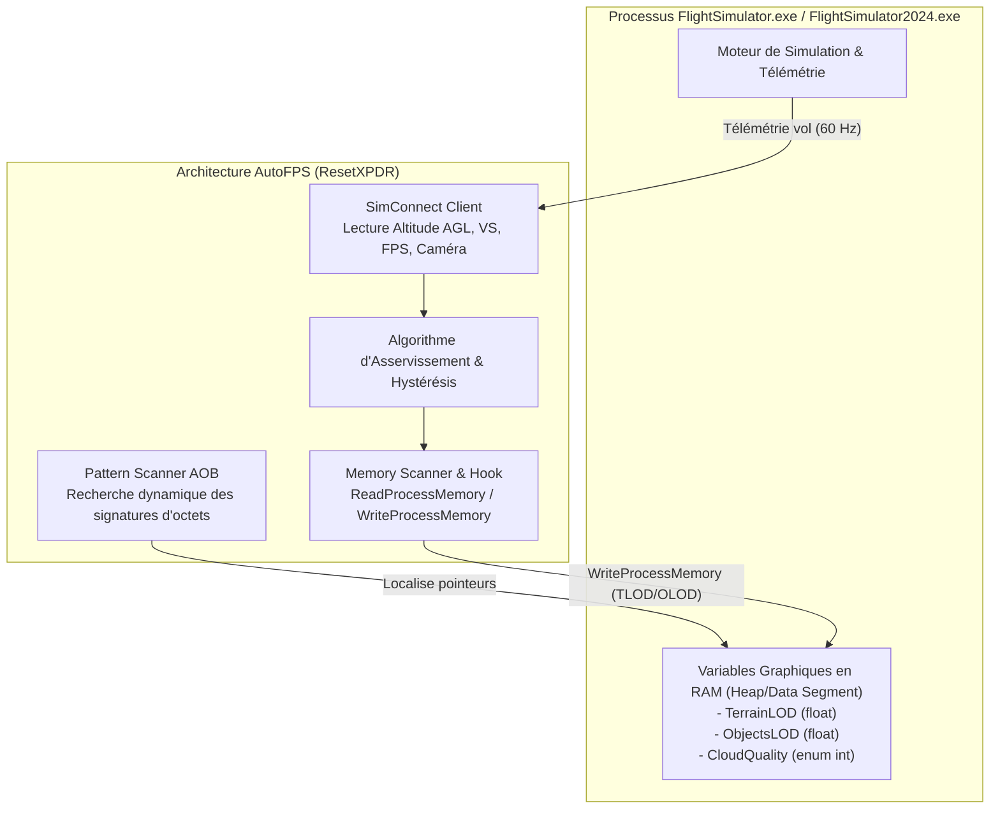
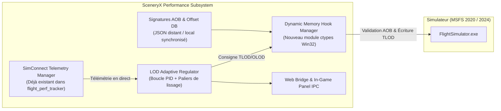
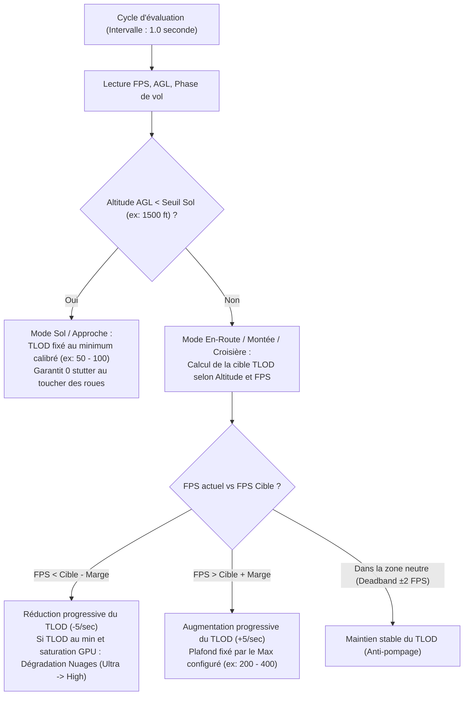

# Design Technique : Moteur Natif Dynamic Auto-FPS pour SceneryX

## 1. Vision et Objectifs Stratégiques

L'intégration d'un moteur dynamique d'ajustement des performances de type **AutoFPS** directement au sein de **SceneryX** vise à éliminer le besoin pour les pilotes virtuels d'installer et d'exécuter un utilitaire externe tiers (.NET / C# distinct).

Ce module interne, nommé **SceneryX Dynamic Performance Engine (DPE)**, permet d'ajuster en temps réel et de manière continue les réglages graphiques les plus coûteux pour le CPU et le GPU (principalement le **Terrain LOD (TLOD)**, l'**Object LOD (OLOD)** et la **Qualité des Nuages**) afin de garantir un framerate cible stable sans saccades, quelles que soient les conditions de vol (sol, aéroport ultra-détaillé, croisière haute altitude, météo convective lourde).

### Synergies uniques avec l'écosystème SceneryX
Contrairement à un outil générique autonome :
1. **Connaissance de l'environnement scénique** : SceneryX sait exactement quel aéroport de départ et d'arrivée est chargé, la densité d'addons tiers installés et le budget VRAM réel calculé par le **SceneryX Rig Optimizer**.
2. **Profils contextuels par scène** : Abaissement automatique du TLOD plancher au sol sur les scènes ultra-lourdes (ex: Heathrow, JFK, Roissy) et déverrouillage de TLOD extrêmes en croisière au-dessus des Alpes ou des océans.
3. **Interface unifiée sans Alt-Tab** : Contrôle centralisé via l'UI SceneryX et relais télémétrique vers l'In-Game Panel MSFS déjà connecté.

---

## 2. Analyse Technique : Comment fonctionne AutoFPS (ResetXPDR)

Microsoft Flight Simulator (2020 et 2024) ne propose **aucune variable SimConnect** pour modifier à chaud les réglages graphiques comme le TLOD ou l'OLOD. L'API SimConnect officielle est strictement cantonnée à la physique de vol, à la météo et aux instruments de bord.

Pour contourner cette limitation, l'utilitaire de référence de ResetXPDR utilise une approche en deux volets :



### Mécanismes clés de ResetXPDR :
1. **Acquisition télémétrique via SimConnect** :
   - Altitude Sol (`PLANE ALT ABOVE GROUND`), Vitesse verticale (`VERTICAL SPEED`), Vitesse sol (`GROUND VELOCITY`).
   - État de la caméra (Cockpit, Extérieur, Drone) et statut au sol (`SIM ON GROUND`).
   - Frame timing et FPS moteur (via les frames SimConnect ou hooks de timing).
2. **Accès Mémoire Direct (`ReadProcessMemory` / `WriteProcessMemory`)** :
   - Ouverture du handle de processus MSFS avec `PROCESS_VM_READ | PROCESS_VM_WRITE | PROCESS_VM_OPERATION`.
   - Localisation de l'adresse des variables de rendu en scannant la mémoire à la recherche d'une signature d'octets (AOB - Array of Bytes) propre à la routine de rendu de MSFS.
3. **Gestion des versions & Offset Drift** :
   - À chaque Sim Update ou patch, les adresses absolues changent. Le pattern scanning dynamique retrouve la nouvelle adresse à partir de l'instruction machine.
   - En cas d'échec du test de compatibilité mémoire (signature non trouvée), l'application bascule automatiquement en mode **Read-Only Fail-Safe** sans rien écrire pour prévenir tout risque de crash (CTD) de MSFS.

---

## 3. Architecture du Moteur Natif SceneryX (Dynamic Performance Engine)

L'intégration dans SceneryX s'appuie sur le socle Python/Ctypes déjà présent dans [`flight_perf_tracker.py`](file:///D:/SceneryX/flight_perf_tracker.py) et [`flight_rig_optimizer.py`](file:///D:/SceneryX/flight_rig_optimizer.py), complété par un sous-système de contrôle mémoire dédié.



### Modules constitutifs du Design :

1. **`flight_memory_engine.py`** :
   - Encapsulation des APIs Win32 via `ctypes` (`kernel32.dll`) : `OpenProcess`, `VirtualQueryEx`, `ReadProcessMemory`, `WriteProcessMemory`, `CloseHandle`.
   - Moteur de Pattern Scanning multi-threads rapide (AOB Scanner avec masques d'octets `??`).
   - Base de signatures déclarative supportant MSFS 2020 (SU15+) et MSFS 2024.
2. **`flight_lod_controller.py`** :
   - Boucle d'asservissement exécutée à 1 Hz ou 2 Hz (inutile et contre-productif d'écrire en mémoire à 60 Hz).
   - Calcul de la consigne TLOD/OLOD selon l'altitude AGL, le FPS instantané et la cadence d'affichage ciblée.
   - Lissage progressif anti-stutter (changement maximal de ±5 ou ±10 points de TLOD par seconde).
3. **`perf_signatures.json`** :
   - Fichier de configuration externe contenant les signatures d'octets et offsets relatifs par version d'exécutable.
   - Permet de mettre à jour les adresses mémoire lors d'un Sim Update sans recompiler l'exécutable `SceneryX.exe`.

---

## 4. Les 4 Piliers Techniques de Réalisation

### Pilier 1 : Accès Mémoire Sécurisé via Ctypes (Zéro Dépendance C#)

Le code Python s'interface directement avec le noyau Windows sans DLL externe :

```python
import ctypes
from ctypes import wintypes

PROCESS_VM_READ = 0x0010
PROCESS_VM_WRITE = 0x0020
PROCESS_VM_OPERATION = 0x0008
PROCESS_QUERY_INFORMATION = 0x0400

kernel32 = ctypes.WinDLL('kernel32', use_last_error=True)

OpenProcess = kernel32.OpenProcess
OpenProcess.argtypes = [wintypes.DWORD, wintypes.BOOL, wintypes.DWORD]
OpenProcess.restype = wintypes.HANDLE

ReadProcessMemory = kernel32.ReadProcessMemory
ReadProcessMemory.argtypes = [wintypes.HANDLE, wintypes.LPCVOID, wintypes.LPVOID, ctypes.c_size_t, ctypes.POINTER(ctypes.c_size_t)]
ReadProcessMemory.restype = wintypes.BOOL

WriteProcessMemory = kernel32.WriteProcessMemory
WriteProcessMemory.argtypes = [wintypes.HANDLE, wintypes.LPCVOID, wintypes.LPCVOID, ctypes.c_size_t, ctypes.POINTER(ctypes.c_size_t)]
WriteProcessMemory.restype = wintypes.BOOL
```

### Pilier 2 : AOB Pattern Scanning & Résilience aux Patches

Pour s'affranchir des adresses statiques qui changent à chaque compilation de MSFS :
- Le scanner parcourt les sections de code exécutable (`MEM_COMMIT` avec protection `PAGE_EXECUTE_READ` ou `PAGE_READWRITE`).
- Recherche d'une séquence caractéristique d'octets qui accède à la structure de configuration du moteur graphique.
- **Safety Test au démarrage** : Lecture de la valeur trouvée. Si la valeur lue n'est pas un flottant cohérent (ex: entre `10.0` et `1000.0` pour TLOD), le pointeur est invalidé immédiatement et aucune écriture n'est effectuée.

### Pilier 3 : Algorithme de Régulation Adaptative (LOD & Nuages)

L'algorithme de régulation fonctionne selon une hiérarchie en 3 phases :



### Pilier 4 : Prise en charge Frame Generation (DLSS 3) et Fréquences Écran

Le moteur intègre la matrice de détection déjà conçue dans le SceneryX Optimizer :
- **Si Frame Generation (DLSS 3) est actif** : Le framerate mesuré par le système d'affichage (ex: 80 FPS) est deux fois supérieur au framerate réel du moteur graphique (40 FPS de base).
- La boucle d'asservissement calcule ses décisions sur le **framerate interne réel (Base FPS / MainThread)** afin d'éviter d'ajuster le TLOD sur une illusion d'affichage fluidifiée qui masquerait une saturation CPU sous-jacente.

---

## 5. Matrice Comparative : AutoFPS Externe vs SceneryX Natif

| Critère | ResetXPDR MSFS_AutoFPS | SceneryX Dynamic Engine (Design Natif) |
| :--- | :--- | :--- |
| **Exécution** | Application externe distincte (.NET WPF) | **Intégré 100% dans le binaire SceneryX.exe** |
| **Interface** | Fenêtre dédiée + widget optionnel | **Dashboard SceneryX unifié + télémétrie existante** |
| **Connaissance des Addons** | Aucune (ignore quelles scènes sont actives) | **Totale (base scènes installées, aéroports, profils GSX)** |
| **Gestion VRAM** | Ne connaît pas le budget VRAM en amont | **Calcul préventif du budget VRAM via le Rig Optimizer** |
| **Mises à jour MSFS** | Recompilation de l'app requise en cas de patch majeur | **Mise à jour dynamique des signatures via JSON distant** |
| **Consommation Ressources** | Processus C# additionnel en tâche de fond | **Fil d'exécution léger Python (<0.1% CPU, ~15 Mo RAM)** |

---

## 6. Gestion des Risques & Sécurité Mémoire

1. **Intégrité du Simulateur (Anti-Crash)** :
   - `WriteProcessMemory` n'est activé **que si et seulement si** le test d'intégrité de lecture (Read Validation) réussit 3 cycles consécutifs avec des valeurs réalistes.
   - En cas d'exception ou de valeur anormale, fermeture immédiate du handle mémoire et passage en mode passif.
2. **Antivirus & Heuristiques Windows Defender** :
   - L'utilisation de `WriteProcessMemory` sur un processus tiers peut parfois déclencher une alerte heuristique.
   - *Mesures de mitigation* : Signature de code, exclusion automatique documentée, et option dans les paramètres de SceneryX permettant à l'utilisateur d'activer ou de désactiver le composant mémoire d'un simple switch (Mode AutoFPS Dynamique On/Off).
3. **Politique Asobo / Forums Officiels** :
   - L'accès mémoire aux réglages de rendu n'étant pas une API officielle, cette fonctionnalité sera clairement documentée dans SceneryX comme un module avancé d'optimisation en temps réel, avec possibilité de fonctionner en mode télémétrique pur (monitoring seul) si l'utilisateur le souhaite.

---

## 7. Feuille de Route du Design

- **Étape 1 (Socle Mémoire)** : Développement du module `flight_memory_engine.py` et validation des offsets de lecture/écriture sur MSFS 2020 et MSFS 2024.
- **Étape 2 (Régulateur d'Asservissement)** : Conception de l'algorithme PID avec deadband et gestion de la transition Sol/Croisière.
- **Étape 3 (Contrôles UI)** : Ajout d'une carte de contrôle "Dynamic Auto-FPS" dans l'onglet Flight Optimizer de SceneryX (activation du toggle, curseurs Min/Max TLOD, FPS cible, mode nuages).
- **Étape 4 (Synchronisation In-Game)** : Relais des valeurs actives (TLOD courant, statut de régulation) vers la barre de statut et le panneau In-Game.
