# Design Technique : SceneryX Rig Optimizer & Audit de Performance

## 1. Vision et Objectifs
Le **SceneryX Rig Optimizer** est un module d'audit matériel/logiciel et de recommandation de réglages ultra-précis pour Microsoft Flight Simulator (MSFS 2020 & 2024).

Contrairement aux assistants génériques basés sur des prompts textuels approximatifs, ce système repose sur :
1. **L'auto-détection complète et automatique sans friction** (BIOS, CPU, GPU, VRAM, RAM, HAGS, RBar, écran, versions DLSS, réglages actuels de `UserCfg.opt` et addons installés).
2. **La validation ou modification manuelle par l'utilisateur** (possibilité de corriger ou de simuler un autre composant en un clic).
3. **Un moteur d'optimisation mathématique et déterministe** qui calcule la cadence d'affichage idéale, le budget VRAM et le profil AutoFPS selon le type de vol.
4. **Une prédiction chiffrée des performances** (FPS cibles affichés, FPS moteur natif, latence MainThread estimée et marge de sécurité VRAM).

---

## 2. Matrice d'Auto-Détection du Système (Zéro Effort)

Le module interroge directement les interfaces Windows (WMI, CIM, Registre, `nvidia-smi`, `UserCfg.opt` et base DLSS Swapper) :

```mermaid
flowchart TD
    subgraph AutoDetect["Auto-Détection Automatique (1.5s)"]
        D_CPU["CPU : Modèle, Cœurs, Fréquence (WMI Win32_Processor)"]
        D_GPU["GPU : RTX 4080, VRAM (16 Go), Pilote (nvidia-smi)"]
        D_RBAR["Re-Size BAR : État BAR1 (16384 Mo = Actif / 256 Mo = Inactif)"]
        D_RAM["RAM : 64 Go @ 3600 MHz (XMP vérifié via ConfiguredClockSpeed)"]
        D_DISP["Écran : 2560x1440 @ 180.06 Hz (EnumDisplaySettings)"]
        D_HAGS["Windows HAGS : Actif (Registre HwSchMode == 2)"]
        D_CFG["Réglages MSFS : UserCfg.opt (TAA/DLSS, FG, FrameLimiter, TLOD)"]
        D_DLSS["Versions DLSS : nvngx_dlss.dll & dlssg (DLSS Swapper DB)"]
        D_ADDONS["Addons Détectés : AutoFPS, GSX, Flow Pro, BeyondATC, Fenix"]
    end

    subgraph UI_Review["Interface de Révision Utilisateur"]
        FORM["Champs pré-remplis modifiables en cas d'erreur ou de simulation"]
        MISSION["Choix de la mission : Type d'avion & Type de vol"]
    end

    subgraph Engine["Moteur d'Optimisation Mathématique"]
        CALC_FPS["Calcul de la cadence d'affichage (Hz / Ratio entier)"]
        CALC_VRAM["Allocation du budget VRAM réel (Seuil 85% sécurité)"]
        CALC_AUTOFPS["Génération de la courbe AutoFPS (TLOD Sol vs Croisière)"]
    end

    subgraph Report["Fiche de Recommandation & Prédiction"]
        OUT_FPS["FPS Prédits & Stabilité MainThread"]
        OUT_SETTINGS["Tableau des réglages complets prêts à appliquer"]
    end

    AutoDetect --> UI_Review
    UI_Review --> Engine
    Engine --> Report
```

---

## 3. Détail des Métriques Détectées et Rôle dans les Performances

### A. Socle Matériel & BIOS
* **Processeur (CPU) & Technologie de Cache** :
  * Détection du modèle exact (ex: *Intel Core i9-13900K* ou *AMD Ryzen 7 7800X3D*).
  * Les processeurs avec 3D V-Cache (X3D) permettent de tolérer des TLOD plus élevés au sol sans asphyxier le MainThread.
* **Mémoire Vive (RAM) & Profil XMP / EXPO** :
  * Capacité totale (ex: 64 Go) et fréquence réelle appliquée (ex: 3600 MHz).
  * Si la fréquence relevée correspond à la vitesse JEDEC par défaut (ex: 2133/4800 MHz au lieu de 3600/6000 MHz), l'outil signale immédiatement que le profil XMP est inactif dans le BIOS (-15 % de perfs MainThread).
* **Re-Size BAR (RBar)** :
  * Détecté via l'allocation `BAR1` du pilote NVIDIA (16 384 MiB alloués = RBar actif).
  * Indispensable sous DirectX 12 pour permettre au processeur d'écrire directement dans l'ensemble de la VRAM.
* **Écran & Résolution** :
  * Résolution native (ex: 2560x1440) et taux de rafraîchissement réel (ex: 180.06 Hz).
  * Statut VRR / G-Sync (Supporté ou Non supporté).

### B. Configuration Windows & Pilotes GPU
* **HAGS (Planification de processeur graphique à accélération matérielle)** :
  * Clé de registre `HKLM\SYSTEM\CurrentControlSet\Control\GraphicsDrivers\HwSchMode`.
  * Valeur `2` = Activé (requis pour DLSS 3 Frame Generation).
* **Taille du Cache de Nuanceurs NVIDIA (Shader Cache)** :
  * Vérification du seuil NVIDIA (recommandation : 100 Go pour supprimer les purges intempestives en plein vol).
* **Version du DLL DLSS & DLSS Swapper** :
  * Lecture de la base SQLite `dlss_swapper.db` pour identifier la version active de `nvngx_dlss.dll` et `nvngx_dlssg.dll` (ex: v3.10.9.1).

### C. Réglages Internes de MSFS (`UserCfg.opt`)
* Lecture automatique des paramètres graphiques actifs :
  * Mode d'anti-aliasing & DLSS (`DLSSMode`).
  * Mode Frame Generation (`FrameGeneration DLSSG`).
  * Limiteur de FPS (`TargetFrameRate` & `FrameLimiter`).
  * Valeur de Terrain LOD et Object LOD.

---

## 4. Algorithme de Recommandation et Calcul des FPS

### A. Règle du Ratio de Synchronisation Parfaite (Frame Pacing)
Pour un écran sans G-Sync ou à taux fixe, l'algorithme calcule le diviseur entier :
$$\text{Cible FPS Affichés} = \frac{\text{Fréquence Écran (Hz)}}{N} \quad (N \in \{1, 2, 3\})$$
* **Écran 180 Hz** :
  * $N = 2 \implies 90 \text{ FPS affichés}$.
  * Avec DLSS Frame Gen 2X : **Cible Moteur = 45 FPS**.
  * Budget temps par trame moteur : $22.26 \text{ ms}$ (Le CPU a une marge énorme si son MainThread est à 18 ms).
* **Écran 144 Hz** : Cible 72 FPS (36 FPS moteur).
* **Écran 120 Hz** : Cible 60 FPS (30 FPS moteur).
* **Écran 60 Hz** : Cible 60 ou 30 FPS.

### B. Règle du Budget VRAM
* Si la VRAM matérielle totale $\le 16 \text{ Go}$ et que l'utilisateur vole sur un avion de ligne à cockpit complexe (A320 Fenix, B777 PMDG) :
  * Recommandation : **Terrain Detail = LOW** (libère ~7 Go de VRAM sans perte visuelle en altitude).
  * Fenix App : Display Rendering sur Balanced ou CPU.
  * SceneryX : Mode **Direct A ➔ B** préconisé.
* Si VRAM $\ge 24 \text{ Go}$ (RTX 3090/4090) ou vol VFR :
  * Terrain Detail sur HIGH ou ULTRA autorisé.

### C. Calibration Personnalisée pour AutoFPS
* **Vol IFR / Liner lourd** :
  * *TLOD Base Min* : 120 (au sol, sous 100 ft AGL).
  * *TLOD Top Max* : 250 (au-dessus de 3 000 ft AGL).
  * *OLOD Cruise* : 20 (au-dessus de 10 000 ft AGL).
  * *VRAM+* : Activé avec seuil de sécurité à 96 %.
* **Vol VFR / Appareil Léger** :
  * *TLOD Base Min* : 150.
  * *TLOD Top Max* : 200.
  * *OLOD* : Maintenu à 100 pour voir les infrastructures locales.

---

## 5. Déroulement du Questionnaire & Expérience Utilisateur

1. **Étape 1 : Diagnostic Automatique Instantané**
   * L'outil s'ouvre avec l'ensemble des données matérielles et logicielles déjà remplies.
   * Des badges verts valident les points forts (*XMP Actif*, *RBar Actif*, *HAGS Actif*, *DLSS 3.10 Détecté*).
   * Des alertes orange indiquent d'éventuelles anomalies (*Attention : Cache shaders NVIDIA limité à 4 Go*).
2. **Étape 2 : Validation & Ajustement Manuel**
   * L'utilisateur peut modifier n'importe quel champ si besoin (par exemple s'il prévoit de changer d'écran ou de résolution).
3. **Étape 3 : Choix de la Mission**
   * Sélection de l'appareil (ex: *Fenix A320*).
   * Sélection du type de vol (ex: *IFR Hub à Hub*).
   * Addons de trafic en cours d'utilisation (*BeyondATC*, *FSLTL*, *SayIntentions*).
4. **Étape 4 : Fiche Récapitulative et Estimation**
   * **FPS Estimés** : Plage exacte prédite (ex: `90 FPS constants`).
   * **Tableau comparatif** : Vos réglages actuels vs Réglages recommandés.
   * **Bouton d'application** : Possibilité d'appliquer directement les réglages recommandés au simulateur ou à AutoFPS.
