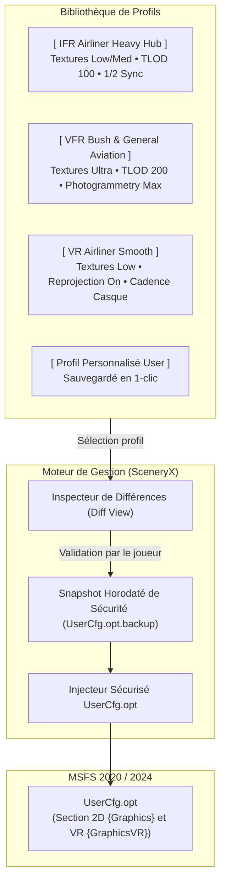

# Design_Technical_Hardware_Profile_Manager

## 1. Vue d'Ensemble & Vision Produit

Ce document définit le **Design Technique** du gestionnaire de profils matériels et graphiques (**Hardware Profile Manager**) dans SceneryX.

Dans Microsoft Flight Simulator (MSFS 2020 et MSFS 2024), les exigences matérielles varient drastiquement selon le type de vol :
- Un vol en **Liner complexe (Fenix A320, PMDG 777, FBW A380)** sur un hub international payware saturé requiert une gestion drastique de la VRAM (textures modérées, TLOD maîtrisé) pour éviter les saccades D3D12.
- Un vol **VFR en Aviation Générale (GA)** au-dessus des Alpes ou d'un archipel permet de pousser la qualité du terrain, les textures et la photogrammétrie au maximum.
- Une session en **Réalité Virtuelle (VR)** requiert une synchronisation stricte au 1/2 rafraîchissement natif du casque (36/40/45/60 FPS) et un profil graphique dédié distinct du mode 2D.

Le **Hardware Profile Manager** de SceneryX permet au simmer de sauvegarder, basculer et synchroniser ses configurations graphiques en un clic, avec un niveau de sécurité et de clarté visuelle inédit.

---

## 2. Audit Comparatif : IslandSimPilot Profile Manager

### 2.1. Analyse des Forces
- **Prise de conscience du besoin** : A le mérite de répondre à une vraie frustration des simmers (perte de temps à réajuster les menus graphiques en fonction de l'avion ou de la scène).
- **Couverture multi-fichiers** : Sauvegarde `UserCfg.opt`, `Content.xml`, `EXE.xml`, caméras et fichiers de contrôles.
- **Support MSFS 2020 & 2024**.

### 2.2. Faiblesses Majeures et Problèmes Identifiés
1. **L'écueil du "Fourre-tout opaque" (Mélange des genres)** :
   - En intégrant dans le même profil les réglages graphiques ET les périphériques/contrôles ET les caméras custom, le risque de régression est immense. Un joueur qui charge un profil graphique "Airliner" peut accidentellement écraser des calibrations de palonnier ou des caméras d'ailes qu'il a mis des heures à peaufiner.
2. **Conflits avec le Cloud Microsoft / Xbox (Xbox Cloud Save)** :
   - Les contrôleurs et certains profils sont synchronisés en temps réel par les serveurs Xbox. Injecter des fichiers locaux de contrôleurs par un tiers provoque régulièrement la boîte de dialogue anxiogène de MSFS : *"Vos données locales et vos données cloud ne correspondent pas"*, avec risque de suppression des réglages utilisateur.
3. **Absence de Diff Visuel (Application à l'aveugle)** :
   - L'interface ne montre pas ce qui va concrètement changer dans le simulateur avant d'appliquer. L'utilisateur clique et espère que rien n'a été corrompu.
4. **Zéro intelligence matérielle** :
   - Simple copieur/colleur de fichiers texte. L'outil n'a aucune conscience de la carte graphique installée (VRAM 12 Go vs 16 Go vs 24 Go), du processeur, ni du casque VR connecté.

---

## 3. Positionnement & Philosophie de SceneryX

| Critère | IslandSimPilot Profile Manager | SceneryX Profile Manager |
| :--- | :--- | :--- |
| **Périmètre d'action** | Fichiers multiples (graphismes, contrôles, caméras) | **Ciblage chirurgical** : Graphismes & Performance (`UserCfg.opt` 2D & VR) sans toucher aux périphériques |
| **Sécurité Cloud** | Risque élevé de conflits Xbox Cloud Save | **Zéro interférence** avec les sauvegardes de contrôles Cloud |
| **Transparence** | Opaque (copie brute de fichiers) | **Diff visuel avant/après** avec estimation de l'impact VRAM et FPS |
| **Conscience Matérielle** | Aucune (outil aveugle) | Détecte le CPU, la VRAM réelle du GPU et le taux de rafraîchissement d'écran/casque VR |
| **Intégration Vol** | Déconnecté du plan de vol | Suggère automatiquement le profil adapté selon l'avion et la route préparée |

---

## 4. Analyse Stratégique : Le Bouton "Lancer MSFS" depuis SceneryX

### 4.1. Dilemme
Faut-il ajouter un bouton `[ ✈ LANCER MSFS ]` dans SceneryX ?

### 4.2. Diagnostic Technique & Retours Communauté
- **Les Risques Techniques** :
  1. **Multiplicité des canaux de distribution** : MSFS existe en version **Microsoft Store / Xbox App** (fichiers chiffrés UWP sous `shell:appsFolder\Microsoft.FlightSimulator...`), **Steam** (`steam://rungameid/1250410`), et **MSFS 2024** (noms de packages distincts). Un lancement automatisé tiers échoue fréquemment en générant des erreurs de permissions Windows ou de validation de licence Xbox.
  2. **Écosystème de démarrage des simmers** : Les passionnés disposent déjà d'une séquence de lancement établie (scripts batch, Process Lasso pour l'affinité CPU, FSUIPC, OpenXR Toolkit, TrackIR). Tenter de se substituer au launcher crée des conflits d'ordonnancement.
  3. **Risque de corruption si écriture en cours** : Si l'utilisateur clique frénétiquement sur "Lancer" pendant que des liens de scènes ou un profil `UserCfg.opt` sont en cours d'application, MSFS peut démarrer dans un état incomplet.

### 4.3. Recommandation pour SceneryX
- **Position officielle retenue** : **SceneryX est un outil d'ingénierie et d'optimisation de vol, pas un launcher d'OS.**
- La règle d'or est : **"SceneryX prépare et optimise le vol, le simmer lance son simulateur comme il l'a toujours fait."**
- **Option envisageable (si souhaitée)** : Ne jamais imposer ce bouton comme action principale. Si présent, il doit s'agir d'une icône discrète en en-tête, désactivable dans les paramètres, et munie d'une protection vérifiant que tous les accès disques sont terminés.

---

## 5. Spécifications du Hardware Profile Manager

### 5.1. Profils Prédéfinis Intelligents (Factory Presets)
SceneryX fournira dès le départ 4 profils de référence calibrés en fonction de la VRAM et du CPU détectés :
1. **`[ IFR AIRLINER - HEAVY HUB ]`** :
   - Résolution de textures : **LOW** (gain de 6 à 8 Go de VRAM sur gros hubs).
   - Terrain LOD (TLOD) : **100 - 120** (soulage le MainThread CPU).
   - Trafic au sol & véhicules aéroportuaires : modérés.
2. **`[ VFR GENERAL AVIATION - ULTRA SCENIC ]`** :
   - Résolution de textures : **ULTRA / HIGH**.
   - Terrain LOD (TLOD) : **175 - 225** (distance de vue maximale pour paysages).
   - Photogrammétrie & Nuages : **ULTRA**.
3. **`[ VR AIRLINER - ZERO STUTTER ]`** :
   - Section `{GraphicsVR}` dédiée.
   - Textures : **LOW** (évite le paging D3D12 dévastateur en VR).
   - Fréquence calée sur le taux natif du casque VR détecté (Pimax, Quest, Index).
4. **`[ BALANCED NATIVE ]`** :
   - Profil équilibré tout-terrain basé sur la calibration initiale du simmer.

### 5.2. Gestion des Profils Utilisateur
- **Création instantanée** : Bouton `[ + Enregistrer la configuration actuelle ]` :
  - Saisie du nom (ex: *"Mon profil Fenix LFPO"*).
  - Sélection de la catégorie : `Airliner`, `VFR / GA`, `VR`, `Benchmark`.
  - Notes libres optionnelles.
- **Stockage structuré** : Sauvegarde dans un dossier dédié `profiles/` au format JSON clair et versionné (stockant les blocs `{Graphics}` et `{GraphicsVR}`).
- **Export & Import** : Possibilité de partager un profil sous forme de fichier `.sceneryx-profile`.

### 5.3. Visual Diff (La Signature SceneryX)
Avant d'écraser `UserCfg.opt`, une fenêtre modale affiche un tableau comparatif avant/après :
- `Texture Resolution` : `Ultra ➔ Low` **(-6.4 GB VRAM estimé)**
- `Terrain LOD` : `150 ➔ 100` **(+10-15% FPS CPU estimé)**
- Boutons : `[ Annuler ]` ou `[ Confirmer & Appliquer ]`.

### 5.4. Filet de Sécurité (Automated Rollback Snapshot)
Chaque application de profil crée automatiquement une archive :
`UserCfg.opt.backup_profile_YYYYMMDD_HHMMSS`  
Un bouton permanent `[ Restaurer la dernière sauvegarde ]` permet d'annuler immédiatement en cas de comportement inattendu.

---

## 6. Plan par Étapes de Développement

1. **Phase 1 : Architecture Backend (`hardware_profile_service.py`)** :
   - Fonctions d'extraction, parsing et sérialisation des blocs `{Graphics}` et `{GraphicsVR}` de `UserCfg.opt`.
   - Gestionnaire de stockage des profils JSON dans `profiles/`.
   - Mécanisme de calcul du différentiel (diff des paramètres modifiés).

2. **Phase 2 : Interface Utilisateur (UI SceneryX)** :
   - Intégration dans l'onglet **Hardware & MSFS Optimizer**.
   - Liste des profils avec badges de catégorie (`AIRLINER`, `VFR`, `VR`).
   - Modale de création de profil et modale de confirmation avec Diff visuel.

3. **Phase 3 : Intégration avec le Flight Plan Optimizer** :
   - Détection du type de vol préparé pour suggérer le profil optimal avant le décollage.

4. **Phase 4 : Validation & Tests de Régression** :
   - Vérification de l'intégrité de `UserCfg.opt` sur MSFS 2020 et MSFS 2024.
   - Validation que les profils de contrôleurs, caméras et sauvegardes Cloud restent 100% intacts.
