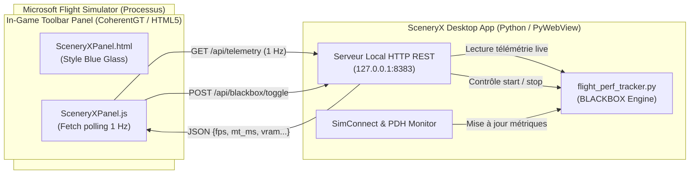
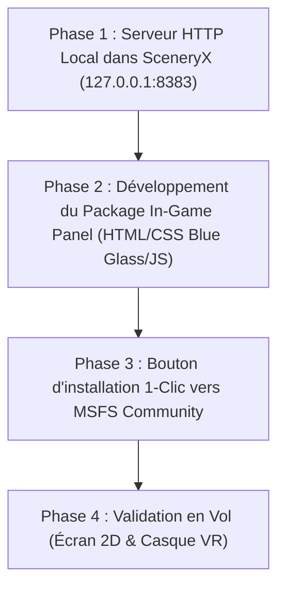

# Design_Technical_InGame_Panel_Telemetry_Remote

## 1. Vue d'Ensemble & Objectifs

Ce document définit le **Design Technique** de la télécommande de télémétrie intégrée directement dans le simulateur (**MSFS In-Game Toolbar Panel**).

L'objectif est d'offrir au simmer un panneau tête haute (HUD / Remote) accessible depuis la barre d'outils supérieure de Microsoft Flight Simulator (MSFS 2020 et MSFS 2024), aussi bien en affichage **Écran 2D** qu'en **Réalité Virtuelle (VR)**, éliminant tout besoin de faire `Alt+Tab` vers l'application SceneryX sur le bureau Windows.

---

## 2. Spécifications Fonctionnelles & Métriques Affichées

Le panel In-Game affiche une sélection condensée des données critiques de vol et de performance, avec le design visuel **"Blue Glass"** officiel des instruments et fenêtres de bord de MSFS :

| Élément | Description & Format | Comportement & Alertes |
| :--- | :--- | :--- |
| **Bouton Start / Stop** | Bouton interactif cliquable : `[ ● START RECORDING ]` / `[ ■ STOP & DEBRIEF ]` | Déclenche ou arrête l'enregistrement de la boîte noire sans quitter le cockpit. |
| **Status & Chronomètre** | `00:00:00` + Statut `STANDBY` ou `REC ●` | Clignotement discret vert/rouge durant la capture active. |
| **Displayed FPS** | FPS réels perçus à l'écran (ex: `98 FPS`) | Mention `(49 base • FG ON)` si Frame Generation ou `(49 base)` si natif. |
| **Frame Pacing (MainThread)** | Temps de trame CPU MainThread en millisecondes (ex: `21.4 ms`) | **Vert** ($\le 22.5\text{ ms}$ $\rightarrow 45\text{+ FPS}$), **Ambre** ($22.5\text{ à }33.3\text{ ms}$), **Rouge** ($> 33.3\text{ ms}$). |
| **VRAM Consommée** | VRAM dédiée consommée par MSFS (ex: `10.4 GB / 16.0 GB`) | Calculée par PDH GPU Process Memory (`GPU Process Memory(pid_*)`). |
| **Rolling Cache I/O** | Débit de lecture instantané du cache (ex: `4.2 MB/s`) | Indique les accès disques / photogrammétrie en cours. |
| **Avion Détecté** | Titre SimConnect de l'appareil (ex: `FBW A320neo` ou `Fenix A320`) | Mis à jour automatiquement à l'initialisation du vol. |
| **Route Active** | Trajet vol (ex: `LFPO ➔ LFMN` ou `Vol libre (LFPO)`) | Déduit du plan de vol SceneryX ou de l'AD le plus proche. |
| **Mode SceneryX** | Mode de scène actif (ex: `CORRIDOR (+35)`, `A > B (+14)`, `FULL`) | Indique le profil d'optimisation de scènes appliqué. |

---

## 3. Architecture Technique de Communication



### 3.1. Micro-Service HTTP REST Local (SceneryX Backend)
- **Technologie** : `http.server.ThreadingHTTPServer` natif en Python (aucun composant lourd tiers requis, totalement intégré dans l'exécutable autonome `SceneryX.exe`).
- **Écoute** : `127.0.0.1:8383` (boucle locale pure, ultra-sécurisée, aucun accès extérieur).
- **Gestion CORS** : Entêtes `Access-Control-Allow-Origin: *` systématiques pour autoriser les requêtes venant du bac à sable CoherentGT de MSFS.
- **Endpoints clés** :
  1. `GET /api/telemetry` :
     Retourne l'état complet en JSON :
     ```json
     {
       "connected": true,
       "is_tracking": true,
       "elapsed_str": "00:12:45",
       "displayed_fps": 98,
       "base_fps": 49,
       "main_thread_ms": 21.4,
       "msfs_vram_mb": 10650,
       "vram_total_mb": 16376,
       "cache_read_mbps": 3.8,
       "aircraft": "FlyByWire Simulations A320neo",
       "route_display": "LFPO ➔ LFMN",
       "mode_display": "CORRIDOR (+35 scènes)",
       "autofps_active": true
     }
     ```
  2. `POST /api/blackbox/start` : Lance l'enregistrement avec le contexte actuel.
  3. `POST /api/blackbox/stop` : Arrête l'enregistrement et génère le rapport HTML de benchmark.
  4. `POST /api/blackbox/toggle` : Bascule l'état start/stop en un clic.

---

## 4. Structure du Package MSFS In-Game Panel

Le panneau est packagé sous forme d'un add-on standard MSFS Community :

```text
sceneryx-ingame-panel/
├── manifest.json                           # Métadonnées du package (titre, version, fabricant)
├── layout.json                             # Indexation des fichiers et tailles pour MSFS
└── html_ui/
    └── InGamePanels/
        └── SceneryXRemote/
            ├── SceneryXRemote.html         # Structure DOM compacte
            ├── SceneryXRemote.css          # Thème Blue Glass MSFS
            ├── SceneryXRemote.js           # Client polling & interactions
            └── icon.svg                    # Icône pour la barre d'outils MSFS
```

### 4.1. Manifeste (`manifest.json`)
```json
{
  "dependencies": [],
  "content_type": "TOOLBAR",
  "title": "SceneryX Live Telemetry Remote",
  "manufacturer": "SceneryX",
  "creator": "SceneryX Team",
  "package_version": "1.0.0",
  "minimum_game_version": "1.30.0"
}
```

---

## 5. Design Visuel "Blue Glass" (Interface & Ergonomie)

### 5.1. Charte Graphique Cockpit MSFS
- **Fond** : `rgba(10, 20, 32, 0.88)` avec `backdrop-filter: blur(12px)`.
- **Bordures** : `1px solid rgba(56, 189, 248, 0.25)` avec liseré intérieur cyan discret.
- **Typographie** : Famille `Bahnschrift`, `RobotoMono` ou `Consolas`.
- **Dimensions standard** : Largeur fixe de **320px**, hauteur adaptative d'environ **240px** (non intrusive sur le tableau de bord).

### 5.2. Wireframe du Panel

```text
┌────────────────────────────────────────────────────────┐
│ ✈ SCENERYX TELEMETRY HUD                 [ — ] [ ✕ ]   │
├────────────────────────────────────────────────────────┤
│ AIRCRAFT : FlyByWire Simulations A320neo              │
│ ROUTE    : LFPO ➔ LFMN   •   MODE : CORRIDOR (+35)     │
├────────────────────────────────────────────────────────┤
│   DISPLAYED FPS           MAIN THREAD (PACING)         │
│      98.4                     21.2 ms                  │
│   (49 base • FG)          [ Fluide / Optimal ]         │
├────────────────────────────────────────────────────────┤
│   MSFS VRAM               ROLLING CACHE                │
│     10.4 GB                  4.2 MB/s                  │
│   (Total: 12.1 GB)        (Lecture active)             │
├────────────────────────────────────────────────────────┤
│  ● REC 00:14:22                                        │
│  [ ■ STOP FLIGHT & DEBRIEF ]                           │
└────────────────────────────────────────────────────────┘
```

### 5.3. État Déconnecté / Hors Ligne
Si l'application de bureau SceneryX n'est pas encore lancée :
- Un badge discret orange apparaît : `● SceneryX Déconnecté (Lancer SceneryX sur le bureau)`.
- Les valeurs affichent `--` sans générer d'erreurs ou de ralentissements dans le simulateur.

---

## 6. Déploiement et Intégration en 1 Clic

Pour simplifier l'installation sans manipulation complexe de fichiers par l'utilisateur :
1. **Intégration dans SceneryX Desktop** :
   - Ajout d'une option dans le panneau des réglages ou dans l'onglet Télémétrie :  
     `[ Installer le Panel In-Game dans MSFS Community ]`.
2. **Processus Automatisé** :
   - Détection du chemin du dossier `Community` (déjà géré par le scanner de SceneryX).
   - Création d'un lien symbolique (*Directory Junction*) ou copie du dossier `sceneryx-ingame-panel`.
   - Génération dynamique de `layout.json` pour garantir une intégrité parfaite.

---

## 7. Plan par Étapes de Développement



1. **Étape 1 : Micro-serveur HTTP dans `flight_perf_tracker.py` / `main.py`**
   - Mise en place d'un thread daemon `HTTPServer` léger.
   - Exposition de `GET /api/telemetry` et `POST /api/blackbox/toggle`.
   - Tests via requêtes `curl` ou navigateur web standard.

2. **Étape 2 : Conception du Package `sceneryx-ingame-panel`**
   - Création de l'arborescence standard MSFS.
   - Réalisation de la vue HTML et de la feuille de style CSS Blue Glass.
   - Script JS avec fonction de rafraîchissement à 1 seconde et gestion de l'action clic Start/Stop.

3. **Étape 3 : Installateur / Synchroniseur dans l'interface SceneryX**
   - Vérification de la présence du panel dans `Community`.
   - Bouton de synchronisation / désinstallation facile.

4. **Étape 4 : Tests en conditions réelles**
   - Test en vol complet (départ, montée, croisière, atterrissage).
   - Vérification du déclenchement du rapport de débriefing à l'arrêt depuis le cockpit.
