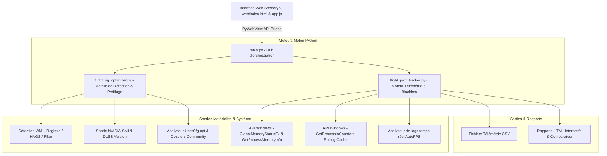

# Design Technique : Suite Performance & Flight Rig Optimizer dans SceneryX (v1.0.1)

---

## 1. Vision Globale : Le Cockpit Complet de Performance MSFS

L'intégration conjointe du **Flight Rig Optimizer** et du **Flight Performance Tracker** transforme radicalement SceneryX :
L'application ne se limite plus à la seule gestion des dossiers de scènes, elle devient la **Suite Intégrée de Contrôle & Performance MSFS (2024 / 2020)**.

L'expérience utilisateur couvre désormais les trois temps clés du vol :
1. **Avant le vol (Pre-Flight Optimizer)** :
   * Détection instantanée du matériel (CPU, GPU, RAM, XMP, RBar, HAGS, Écran Hz, DLSS).
   * Sélection de l'avion / studio (ex: Flight Sim Labs A321, Fenix, PMDG) et profilage sur mesure.
   * Calcul du ratio de synchronisation parfait (Frame Pacing), calibration AutoFPS et isolation des scènes **Direct A ➔ B**.
2. **Pendant le vol (In-Flight Blackbox & Live HUD)** :
   * Démarrage et arrêt du tracking en 1 clic directement depuis SceneryX.
   * Mini-barre de télémétrie en temps réel (FPS affichés/base, MainThread ms, VRAM physique totale, lecture Rolling Cache en Mbps, TLOD dynamique).
   * Alerte de dépassement de budget MainThread ou d'engorgement VRAM (> 95 %).
3. **Après le vol (Post-Flight Debriefing & Benchmark Hub)** :
   * Rapport interactif généré automatiquement avec courbes graphiques synchronisées.
   * Compte-rendu narratif automatisé diagnostiquant les goulets d'étranglement (CPU vs GPU vs VRAM vs Disque).
   * Comparateur de vols superposé (ex: *Vol avec toutes les scènes* vs *Vol SceneryX Direct A ➔ B*).

---

## 2. Architecture Logicielle & Découplage Modulaire

Pour garantir une maintenabilité absolue et faciliter la publication ultérieure d'outils autonomes gratuits pour la communauté, le design repose sur des modules indépendants :

### Modules et Responsabilités :
1. `flight_rig_optimizer.py` :
   * Détecteur matériel et sous-systèmes Windows.
   * Moteur mathématique de Frame Pacing ($Hz / N$).
   * Matrice d'empreinte des studios (FSLabs, Fenix, PMDG, iniBuilds, etc.).
   * Générateur de recommandations pour `UserCfg.opt` et AutoFPS.
2. `flight_perf_tracker.py` :
   * Capture de métriques toutes les 500 ms (VRAM physique, RAM Commit/WS, MainThread, FPS, Rolling Cache Mbps, TLOD/OLOD, altitude/VSI).
   * Threading asynchrone non bloquant pour l'interface PyWebView.
   * Génération des comptes-rendus HTML enrichis avec graphiques et diagnostics automatisés.
3. `main.py` :
   * Expose les méthodes PyWebView unifiées (`api.get_rig_diagnostics()`, `api.start_flight_tracker()`, `api.stop_flight_tracker()`, `api.get_live_telemetry()`, `api.list_flight_benchmarks()`).
4. `web/` :
   * Panneau modal unifié **"Performance & Flight Hub"** réunissant le configurateur de vol et le tableau de bord de télémétrie.

---

## 3. Points d'Accès UI dans SceneryX

### A. Barre d'Outils Inférieure (`#bottom-map-toolbar`)
Ajout d'un bouton de contrôle de performance avec icône tachymètre (`fa-solid fa-gauge-high`) :
* **Label** : *Performance & Rig*
* **Statut Visuel Dynamique** :
  * *Gris* : Inactif / Prêt pour configuration.
  * *Cyan clignotant / pulsé* : Vol en cours d'enregistrement (Tracker actif).
  * *Pastille Verte* : Réglages parfaitement alignés avec l'écran et l'appareil.
  * *Pastille Orange* : Alerte de goulot d'étranglement détecté (ex: VRAM limite).

### B. Mini-Barre Live Télémétrie (In-Flight Floating HUD)
Lorsque le simulateur tourne et que le tracker est activé :
* SceneryX propose un mini bandeau compact et flottant (rétractable) affichant :
  * **FPS** (affichés / base moteur).
  * **MainThread** (ms) avec code couleur (vert si $< 20\text{ ms}$, orange si $> 22{,}2\text{ ms}$).
  * **VRAM** (Go et % d'utilisation physique).
  * **Rolling Cache** (lecture en temps réel en Mbps).
  * **LOD** (TLOD / OLOD dynamiques appliqués par AutoFPS).

### C. Bandeau de Plan de Vol Contextuel
Lorsqu'un vol est sélectionné (départ A ➔ arrivée B ou import SimBrief) :
* Bouton d'action directe : *"Préparer les performances pour ce vol"*
* Applique en une seule étape l'isolation des scènes et le profil optimal de l'appareil choisi.

---

## 4. Parcours Utilisateur dans la Modal "Performance Hub"

La modal se compose de 3 onglets principaux :

### Onglet 1 : "Flight Rig Optimizer" (Avant le Vol)
* **Cartouche Matériel & Écran** : CPU, GPU, RAM (XMP), HAGS, RBar, Fréquence Écran (ex: 180 Hz).
* **Sélecteur d'Avion & Studio** : Menu déroulant intuitif incluant le profil ultra-lourd **Flight Sim Labs (FSLabs A321)**, Fenix, PMDG, etc.
* **Résultat de Calibration** :
  * Cible FPS recommandée (ex: 90 FPS sur 180 Hz avec Frame Gen).
  * Recommandation `Terrain Detail = LOW` pour préserver 7 Go de VRAM.
  * Réglages suggérés pour AutoFPS et NVIDIA App.
* **Bouton 1-Clic** : *"Appliquer et Isoler les Scènes pour ce Vol"*.

### Onglet 2 : "Live Blackbox & Tracker" (Pendant le Vol)
* **Bouton Principal** : `[ Démarrer l'Enregistrement du Vol ]` / `[ Arrêter & Analyser ]`.
* **Nom du vol** : Auto-rempli avec les OACI de départ et d'arrivée (ex: `LFPO_EGKK_FSLabs_A321`).
* **Vue en direct** : Graphique miniature des FPS et de la charge MainThread en temps réel.

### Onglet 3 : "Historique & Débriefings" (Après le Vol)
* **Liste des vols enregistrés** : Date, durée, appareil, mode (Baseline vs SceneryX Direct A ➔ B).
* **Actions par vol** :
  * *Ouvrir le rapport d'analyse HTML* (courbes, métriques max/moyennes, diagnostic textuel).
  * *Superposer / Comparer deux vols* (génère le benchmark comparatif instantané).

---

## 5. Perspectives & Stratégie Communautaire (Phase 2)

Grâce à ce design complètement découplé :
1. **SceneryX** conserve l'avantage d'une solution tout-en-un fluide et professionnelle.
2. Un utilitaire allégé gratuit (**SceneryX Performance Blackbox Free**) pourra être extrait et proposé à la communauté sur Flightsim.to, offrant la détection matérielle et le tracker en version autonome.
3. Chaque rapport HTML généré par l'outil gratuit comportera la signature discrète :  
   *"Généré par SceneryX - Boostez vos FPS et libérez votre mémoire sur Flight Simulator"*.
