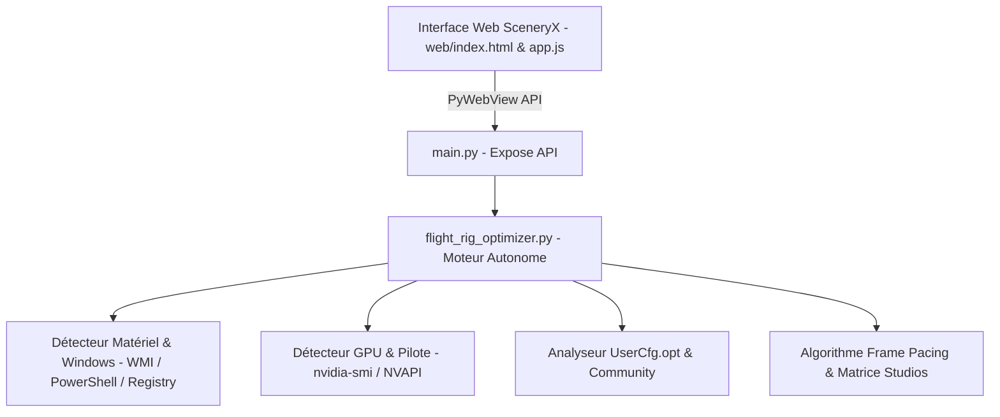

# Design Technique : Intégration du Flight Rig Optimizer dans SceneryX (v1.0.1)

---

## 1. Vision et Objectifs du Module

L'intégration du **Flight Rig Optimizer** directement au sein de SceneryX transforme l'application : de gestionnaire de scènes géographiques, elle devient le **Cockpit d'Optimisation Global du Simulateur (MSFS 2024 / 2020)**.

### Bénéfices Utilisateur Immédiats :
1. **Zéro friction de configuration** : Détection automatique et instantanée du matériel (CPU, GPU, RAM, XMP, RBar, HAGS, Fréquence Écran Hz) et des réglages en vigueur (`UserCfg.opt`, version DLSS).
2. **Recommandations sur mesure selon l'avion & le studio** : Profils calibrés pour Fenix Simulations, PMDG, Flight Sim Labs (A321), iniBuilds, FlyByWire, Just Flight et Asobo.
3. **Prédiction chiffrée** : Calcul du ratio de synchronisation parfait (ex: 180 Hz ➔ 90 FPS affichés / 45 FPS moteur, budget MainThread 22,2 ms) et des marges VRAM pour bannir les micro-saccades et les Crash-to-Desktop (CTD).
4. **Action en 1 clic** : Synergie native avec le mode **Direct A ➔ B** de SceneryX et les profils AutoFPS.

---

## 2. Architecture Logicielle & Découplage

Le design repose sur une séparation stricte des responsabilités afin de permettre ultérieurement une extraction autonome (version standalone gratuite pour la communauté) sans modifier le cœur de SceneryX :

### Modules Techniques :
* `flight_rig_optimizer.py` : Module Python indépendant contenant l'intégralité de la logique de sonde, de calcul et de profilage.
* `main.py` : Enregistre les points d'entrée d'API pour PyWebView (`get_rig_diagnostics()`, `calculate_rig_profile()`, `apply_rig_optimizations()`).
* `web/index.html` : Modal glassmorphism haute fidélité (`#rig-optimizer-modal`) accessible depuis la barre d'outils principale.
* `web/app.js` : Contrôleur UI gérant l'affichage dynamique, le formulaire de simulation interactive et le rendu visuel des gains.

---

## 3. Points d'Accès UI dans SceneryX

### A. Bouton d'Accès Principal (Toolbar Inférieure)
Un nouveau bouton avec icône tachymètre/jauge (`fa-solid fa-gauge-high`) est positionné dans la barre d'outils inférieure `#bottom-map-toolbar` aux côtés des boutons *Export*, *Rescan* et *Settings*.
* **Intitulé** : *Rig Optimizer* (ou *Optimiseur de Vol*).
* **Badge d'état dynamique** : Un point vert pulse discrètement si le simulateur est configuré de façon optimale, orange si un goulot d'étranglement ou un réglage à risque est détecté (ex: Terrain Detail Ultra avec 16 Go de VRAM sur Fenix/FSLabs).

### B. Suggestion Contextuelle lors de la Préparation d'un Vol
Lorsque le pilote trace un corridor de vol ou importe un plan SimBrief (A ➔ B), un bouton d'action rapide apparaît sur le bandeau :
> *"Optimiser mon simu pour ce vol"*
En un clic, SceneryX configure le profil d'avion correspondant, prépare la calibration AutoFPS et isole les scènes nécessaires.

---

## 4. Parcours Interactif de l'Utilisateur (Modal Dédiée)

La modal s'articule autour de 3 panneaux visuels intuitifs :

### Panneau 1 : Diagnostic & Auto-Détection Matérielle
* **Processeur** : Nom, cœurs/threads, fréquence observée.
* **Carte Graphique** : Modèle, pilote actif, VRAM physique totale (ex: RTX 4080 16 Go).
* **Mémoire Vive (RAM)** : Capacité totale, vitesse en MHz, badge vert *"XMP Actif"*.
* **Affichage** : Résolution native et taux de rafraîchissement précis (ex: 2560x1440 @ 180.06 Hz).
* **Sous-système Windows** : Badges *"HAGS Activé"* et *"Re-Size BAR Activé"*.
* **Bibliothèque DLSS** : Version du fichier `nvngx_dlss.dll` détectée (ex: v3.10.9.1 via DLSS Swapper).

*Note : Chaque valeur détectée reste modifiable manuellement via un champ ajustable en cas de configuration multi-écrans ou de détection non standard.*

### Panneau 2 : Paramètres de la Mission de Vol
* **Sélection du Studio & de l'Appareil** :
  * Menu déroulant avec détection automatique des avions installés dans `Community` / `Official`.
  * Studios gérés en priorité : **Flight Sim Labs (FSLabs A321/A320)**, **Fenix Simulations (A320)**, **PMDG (B737/B777)**, **iniBuilds (A300/A350)**, **FlyByWire (A32NX/A380X)**, **Just Flight (BAe 146/PA-28)**, **Asobo / Working Title**.
* **Type de vol** : Vol commercial IFR haute altitude vs Navigation VFR basse altitude.
* **Trafic Injecté** : Aucun, BeyondATC, FSLTL, SayIntentions.AI.

### Panneau 3 : Résultats de l'Optimisation & Recommandations Visuelles
* **Cible de Fluidité (Golden Frame Pacing)** :
  * Calcul exact : Fréquence / Diviseur (ex: 180 Hz / 2 = 90 FPS affichés / 45 FPS moteur avec Frame Gen 2X).
  * Budget temps MainThread alloué : 22,2 ms.
* **Réglages MSFS Recommandés (`UserCfg.opt`)** :
  * Mode DLSS préconisé (Quality vs Balanced).
  * Terrain Detail (ex: LOW recommandé sur FSLabs/Fenix pour épargner 7 Go de VRAM).
  * Limiteur de FPS recommandé dans le simu ou le panneau NVIDIA.
* **Profil AutoFPS Personnalisé** :
  * TLOD Base (sol) et TLOD Cruise (croisière).
  * Seuil VRAM+ recommandé (ex: 96 %).
* **Bouton d'Action 1-Clic** :
  * *"Appliquer & Lancer le Vol"* : Isole les scènes via le mode Direct A ➔ B de SceneryX, génère le profil AutoFPS prêt à l'emploi et propose l'ajustement assisté de `UserCfg.opt`.

---

## 5. Perspectives : Stratégie de Découplage pour la Communauté (Phase 2)

Grâce à la conception modulaire adoptée dans `flight_rig_optimizer.py` :
1. **Binaire autonome** : Le moteur de diagnostic et de calcul pourra être compilé via PyInstaller en un petit utilitaire léger (`SceneryX_Rig_Optimizer_Free.exe`, ~15 Mo).
2. **Diffusion communautaire** : Offert gratuitement sur Flightsim.to et GitHub comme outil de référence d'évaluation hardware pour MSFS 2024 / 2020.
3. **Passerelle naturelle** : L'outil gratuit inclura un lien direct vers SceneryX pour les utilisateurs souhaitant l'automatisation complète et le délestage de scènes en vol.
