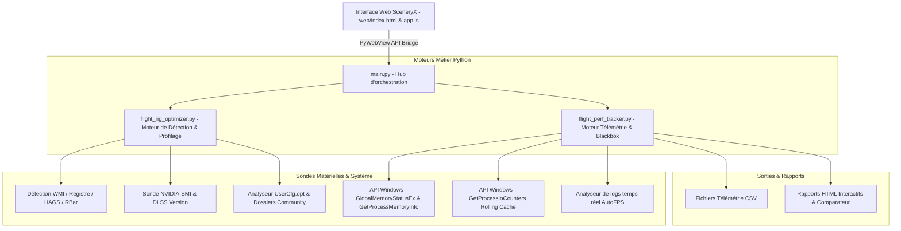

# Design Technique : Suite Performance & Flight Rig Optimizer dans SceneryX (v1.0.1)

---

## 1. Vision Globale : Le Cockpit Complet de Performance MSFS

L'intégration conjointe du **Flight Rig Optimizer** et du **Flight Performance Tracker** transforme radicalement SceneryX :
L'application ne se limite plus à la seule gestion des dossiers de scènes, elle devient la **Suite Intégrée de Contrôle & Performance MSFS (2024 / 2020)**.

L'expérience utilisateur couvre désormais les trois temps clés du vol :
1. **Avant le vol (Pre-Flight Optimizer)** :
   * Détection instantanée du matériel (CPU, GPU, RAM, XMP, RBar, HAGS, Écran Hz, DLSS).
   * Sélection assistée via listes déroulantes de composants filtrables (style e-commerce hardware) et saisie libre.
   * Sélection de l'avion / studio (ex: Flight Sim Labs A321, Fenix, PMDG) et profilage sur mesure.
   * Calcul du ratio de synchronisation parfait (Frame Pacing), calibration AutoFPS et isolation des scènes **Direct A ➔ B**.
2. **Pendant le vol (In-Flight Blackbox & Live HUD)** :
   * Démarrage et arrêt du tracking en 1 clic directement depuis SceneryX.
   * Mini-barre de télémétrie en temps réel (FPS affichés/base, MainThread ms, VRAM physique totale, lecture Rolling Cache en Mbps, TLOD dynamique).
   * Alerte de dépassement de budget MainThread ou d'engorgement VRAM (> 95 %).
3. **Après le vol (Post-Flight Debriefing & Benchmark Hub)** :
   * Rapport interactif généré automatiquement avec courbes graphiques synchronisées.
   * Compte-rendu narratif automatisé diagnostiquant les goulets d'étranglement (CPU vs GPU vs VRAM vs Disque).
   * Comparateur de vols superposé (ex: *Vol avec toutes les scènes* vs *Vol SceneryX Direct A ➔ B*).

---

## 2. Évolution Ergonomique du Menu Radial : "Flight Optimizer"

Dans SceneryX, l'action sur un aéroport n'a jamais été un outil de dispatching complexe (rôle de SimBrief), mais un acte d'**optimisation du simulateur** pour le vol envisagé.

Le quadrant Nord du menu radial évolue donc naturellement :
* **Ancien intitulé** : `FLIGHT PLAN`
* **Nouvel intitulé** : `FLIGHT OPTIMIZER`
* **Légèreté & Esthétique** : Conservation exacte du design aérien, des secteurs SVG circulaires translucides en verre dépoli (Frosted Glassmorphism) et de l'animation de cascade à ressort (Spring Bounce).

```
                 ▲ NORD : [ FLIGHT OPTIMIZER ]
                        (Vol + Rig + Blackbox)
                          ┌─────────────┐
                          │    LFPO     │
       ◄ OUEST :          │ Paris Orly  │          ► EST :
 [ OPERATING AIRLINES ]   │  Payware    │      [ SCENERIES ]
                          └─────────────┘
                 ▼ SUD : [ AIRPORT DETAILS ]
```

---

## 3. Architecture Logicielle & Découplage Modulaire

Pour garantir une maintenabilité absolue et faciliter la publication ultérieure d'outils autonomes gratuits pour la communauté, le design repose sur des modules indépendants :



### Modules et Responsabilités :
1. `flight_rig_optimizer.py` :
   * Détecteur matériel et sous-systèmes Windows.
   * Moteur mathématique de Frame Pacing ($Hz / N$).
   * Matrice d'empreinte des studios (FSLabs, Fenix, PMDG, iniBuilds, etc.).
   * Base de données locale des composants du marché (familles CPU et GPU).
   * Générateur de recommandations pour `UserCfg.opt` et AutoFPS.
2. `flight_perf_tracker.py` :
   * Capture de métriques toutes les 500 ms (VRAM physique, RAM Commit/WS, MainThread, FPS, Rolling Cache Mbps, TLOD/OLOD, altitude/VSI).
   * Threading asynchrone non bloquant pour l'interface PyWebView.
   * Génération des comptes-rendus HTML enrichis avec graphiques et diagnostics automatisés.
3. `main.py` :
   * Expose les méthodes PyWebView unifiées (`api.get_rig_diagnostics()`, `api.start_flight_tracker()`, `api.stop_flight_tracker()`, `api.get_live_telemetry()`, `api.list_flight_benchmarks()`).
4. `web/` :
   * Modal glassmorphism unifiée accessible depuis le quadrant Nord de la radiale et depuis la toolbar inférieure.

---

## 4. Design des Composants de Saisie : Combobox Filtrable & Recherche Libre

Pour offrir une expérience digne des meilleurs configurateurs hardware (style LDLC, PCPartPicker), les sélecteurs de matériel (CPU, GPU, RAM, Écran) fonctionnent en **Combobox Hybride Intelligente** :

### Fonctionnement UX :
1. **Auto-remplissage initial** : Dès l'ouverture, le champ affiche la valeur réelle détectée sur la machine de l'utilisateur (ex: `Intel Core i9-13900K`, `NVIDIA GeForce RTX 4080 (16 Go)`).
2. **Liste déroulante hiérarchisée** : Un clic sur la flèche ou le champ ouvre une liste groupée par catégories :
   * **CPU** : 
     * *Intel 14th / 13th Gen* (i9-14900K, i7-14700K, i9-13900K...)
     * *Intel 12th Gen* (i9-12900K, i7-12700K...)
     * *AMD Ryzen 9000 / 7000 X3D* (Ryzen 7 9800X3D, Ryzen 7 7800X3D, Ryzen 9 7950X3D...)
     * *AMD Ryzen 5000 X3D* (Ryzen 7 5800X3D...)
   * **GPU** :
     * *NVIDIA RTX 50 Series* (RTX 5090 32GB, RTX 5080 16GB...)
     * *NVIDIA RTX 40 Series* (RTX 4090 24GB, RTX 4080 16GB, RTX 4070 Ti Super 16GB, RTX 4070 12GB...)
     * *NVIDIA RTX 30 Series* (RTX 3090 24GB, RTX 3080 Ti 12GB, RTX 3080 10GB...)
     * *AMD Radeon RX 7000 Series* (RX 7900 XTX 24GB, RX 7900 XT 20GB...)
3. **Recherche textuelle instantanée (Typeahead Filter)** : L'utilisateur peut taper directement dans le champ (ex: taper *"7800"* pour isoler le 7800X3D en 2 frappes).
4. **Saisie personnalisée libre (Custom Entry)** : Si l'utilisateur possède un processeur ou une variante non répertoriée, il peut taper son modèle sans être bloqué par la liste.

---

## 5. Parcours Utilisateur dans le Panneau "Flight Optimizer"

Le panneau s'ouvre avec l'aéroport de départ déjà sélectionné :

### Volet 1 : Mission & Route
* **Aéroport de Départ & Arrivée** (avec bouton de permutation et import SimBrief 1-clic).
* **Mode d'isolation des scènes** : Mode **Direct A ➔ B** activé par défaut (délester toutes les scènes intermédiaires).
* **Indicateur de gain immédiat** : Affiche le gain de charge estimé (ex: `515 scènes délestées ~ -2.7 Go Commit RAM`).

### Volet 2 : Rig & Settings
* **Champs de configuration hardware** (Combobox filtrables : CPU, GPU, RAM MHz, Écran Hz).
* **Sélecteur d'Avion & Studio** :
  * **Flight Sim Labs (A321-X / A320)** ➔ Profil calcul intensif MainThread, verrouillage FPS strict 45/90, TLOD sol 110.
  * **Fenix Simulations (A320)** ➔ Profil VRAM & CoherentGT, Terrain Detail LOW, rendu écran CPU/Balanced.
  * **PMDG (B737 / B777)** ➔ Profil WASM équilibré, TLOD High permis.
  * **iniBuilds (A300 / A350)** ➔ Profil VRAM intense, textures cabine allégées.
* **Prédiction de Fluidité** :
  * Cible FPS calculée selon l'écran (ex: 90 FPS sur 180 Hz avec Frame Gen, 22.2 ms budget).
  * Recommandations `UserCfg.opt` et AutoFPS prêtes à l'emploi.

### Volet 3 : Live Blackbox & Télémétrie
* **Bouton d'enregistrement** : `[ ⏺ Démarrer le vol ]` / `[ ⏹ Arrêter et voir le débriefing ]`.
* **Mini HUD en temps réel** : Affichage discret des FPS, du MainThread (ms), de la VRAM totale consommée et de la vitesse de lecture disque / Rolling Cache.
* **Historique des benchmarks** : Accès direct aux rapports HTML et comparatifs de vol.
