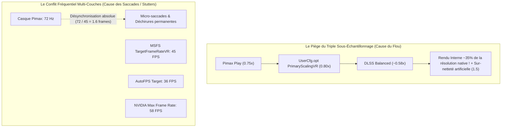
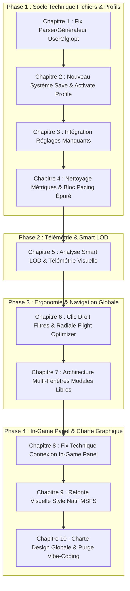

# Design_Technical_VR_2D_Optimization_And_Roadmap_Plan.md

## Synthèse Diagnostic : Pourquoi le système actuel saccade et est flou

Votre machine possède un potentiel exceptionnel (**i9-13900K, RTX 4080 16GB, 64 Go RAM, SSD 980 PRO, Pimax Crystal Light**). Pourtant, la configuration actuelle accumule **5 goulots d'étranglement majeurs** qui s'entrechoquent et détruisent à la fois la netteté et la fluidité :

---

## PARTIE 1 : RÉGLAGES OPTIMAUX PARAMÈTRE PAR PARAMÈTRE

Voici la cartographie exhaustive et cohérente de tous les réglages pour éliminer le flou et obtenir une fluidité parfaite (Frame Pacing métronomique).

---

### 1. Pimax Play (Pimax Crystal Light)
Le Crystal Light dispose de panneaux 2880 × 2880 par œil avec lentilles asphériques en verre. La netteté dépend directement de la résolution transmise.

| Paramètre | Valeur Actuelle | Valeur Optimale Recommandée | Justification Technique |
| :--- | :--- | :--- | :--- |
| **Refresh Rate** | 72 Hz | **90 Hz** (ou **72 Hz** si vous visez 36 FPS) | À 90 Hz avec verrou à **45 FPS** (Half Rate), vous obtenez la cadence VR standard la plus fluide. À 72 Hz, le verrou doit être impérativement à **36 FPS**. |
| **Image Quality** | Customize 0.75 | **1.0 (ou Customize 1.0)** | **Crucial :** Descendre à 0.75 floute nativement les lentilles asphériques avant même que MSFS ne rende l'image. Garder à 1.0 et laisser DLSS gérer l'upscaling. |
| **FOV** | Normal | **Normal** | Idéal pour le ratio confort / performances. |
| **Smart Smoothing** | Off | **On** (si lock à demi-fréquence) ou **Off** (si rendu pur) | Si vous jouez à 45 FPS réels sur écran 90 Hz, le Smart Smoothing interpole 1 image sur 2 pour afficher 90 Hz réels sans saccade. |
| **Lock to Half Framerate** | Off | **Activé** (si Smart Smoothing On) | Force le runtime Pimax à caler le compositeur sur exactement la moitié du rafraîchissement (45 FPS pour 90 Hz, 36 FPS pour 72 Hz). |
| **Fixed Foveated Rendering** | Off | **Off** (géré plus proprement via OpenXR Toolkit) | Évite les conflits de masquage fovéal entre Pimax Play et OpenXR. |
| **Hidden Area Mask** | Décoché | **Coché** | Économise ~5 à 8% de GPU en ne calculant pas les pixels cachés par la bordure circulaire des lentilles. |

---

### 2. OpenXR & OpenXR Toolkit (Mod Primashock v1.3.9)

| Paramètre | Valeur Recommandée | Rôle & Bénéfice |
| :--- | :--- | :--- |
| **OpenXR Runtime** | **Pimax OpenXR** | Indispensable (court-circuite SteamVR et économise 1.5 Go de VRAM et 3 ms de latence). |
| **Upscaling / CAS** | **Off** (si DLSS activé dans MSFS) | Ne **jamais** empiler l'upscaling OpenXR par-dessus le DLSS de MSFS, cela crée un double artefact d'aliasing. |
| **CAS Sharpening** | **15% à 20%** | Apporte un léger piqué sur les instruments sans bruit numérique. |
| **Fixed Foveated Rendering (FFR)** | **Preset Balanced / Custom** (Inner 100%, Outer 50%) | Gain de 15% de temps GPU sans perte visible au centre de vision. |
| **Turbo Mode** | **On** | Permet à MSFS de soumettre les frames immédiatement au compositeur OpenXR sans attendre la v-sync artificielle, éliminant les micro-stutters. |
| **Target Frame Rate (Toolkit)** | **Désactivé** (géré par MSFS ou AutoFPS) | Évite les conflits de limiteurs multiples. |

---

### 3. Fichier MSFS `UserCfg.opt` (Section [Video])

| Clé | Valeur Actuelle | Valeur Optimale | Explication du Gain |
| :--- | :--- | :--- | :--- |
| `PrimaryScalingVR` | `0.800000` | **`1.000000`** | **Règle n°1 du net :** Doit être à 1.0 en VR avec DLSS. Régler à 0.80 floute le rendu interne avant le passage du réseau neuronal DLSS. |
| `AntiAliasingVR` | `DLSS` | **`DLSS`** | Indispensable sur RTX 4080 en résolution Crystal Light. |
| `DLSSModeVR` | `BALANCED` | **`QUALITY`** | En passant de Balanced (58%) à Quality (67%) avec PrimaryScaling à 1.0, les instruments de bord deviennent immédiatement lisibles et nets. |
| `SharpenAmountVR` | `1.500000` | **`0.200000`** | 1.5 est beaucoup trop élevé et génère du grain blanc et du scintillement (scintillement des pistes). |
| `TargetFrameRateVR` | `45` | **`45`** (si Pimax = 90Hz) / **`36`** (si Pimax = 72Hz) | Doit être le diviseur exact du taux de rafraîchissement Pimax. |
| `DynamicSettingsVR` | `1` | **`0`** | Désactiver le changement dynamique de résolution interne qui crée des sautes de netteté brutales en vol. |
| `ReflexVR` | `ON` | **`ON`** (ou `ON+BOOST`) | Réduit la queue de rendu et synchronise le GPU avec le CPU. |

---

### 4. Fichier MSFS `UserCfg.opt` (Section [GraphicsVR])

| Clé | Valeur Actuelle | Valeur Optimale | Impact Visuel & Performance |
| :--- | :--- | :--- | :--- |
| **`DisplacementMapping`** | **`1`** (CATASTROPHE) | **`0`** | **Bogue majeur identifié :** Le Displacement Mapping en VR surcharge violemment le Main Thread et la VRAM pour un effet invisible dans le casque. À désactiver impérativement. |
| **`Terrain LoDFactor`** | `1.500000` (150) | **`1.000000` (100)** | En VR sur Crystal Light, 100 est le point d'équilibre parfait. AutoFPS s'occupera de le monter à 150-200 à haute altitude. |
| **`ObjectsLoD LoDFactor`** | `1.000000` (100) | **`1.000000` (100)** | Idéal pour préserver le Main Thread au sol. |
| **`OffscreenTerrainPreCaching`** | `0` (Low) | **`2` (High)** | À 0, dès que vous tournez la tête en VR, MSFS charge le terrain dans l'urgence = freeze / stutter violent. À 2, il pré-cache en RAM (vous avez 64 Go !). |
| **`VolumetricClouds`** | `2` (High) | **`2` (High)** | Très bon compromis volumétrique / fluidité. |
| **`RaytracedShadows`** | `0` | **`0`** | Conserver désactivé en VR. |
| **`ContactShadows`** | `0` | **`0`** | Évite le scintillement des ombres dans le cockpit. |
| **`Shadows Size`** | `768` | **`1024`** | Ombres cockpit nettes sans surcharger la RTX 4080. |
| **`SSR` (Screen Space Reflections)** | `0` | **`0`** | Conserver désactivé en VR (génère des artefacts asymétriques œil gauche/droit). |
| **`GlassCockpitsRefreshRate`** | `2` (High) | **`1` (Medium)** | Soulage considérablement le CPU (Main Thread) pour les liners (A320, 737, etc.). |

---

### 5. DLSS Swapper & Profils DLL (RTX 4080)

| Paramètre | Valeur Actuelle | Valeur Optimale | Explication |
| :--- | :--- | :--- | :--- |
| **Version DLL** | `v310.6` (3.10.6) | **`v3.7.20` ou `v3.8.10`** | Les builds 3.10 test présentent des régressions de smearing sur les aiguilles et écrans digitaux en VR. La 3.7.20 est la version de référence absolue en simulation. |
| **Préréglage (Preset)** | `Préréglage M` | **`Préréglage E` (ou `C`)** | **Le preset E** est conçu spécialement pour éliminer le "ghosting" (traînées fantômes) derrière les chiffres du cockpit lors des mouvements de tête. Le preset M est instable en VR. |

---

### 6. Panneau NVIDIA (NVIDIA App / NVidia Control Panel)

| Paramètre | Valeur Actuelle | Valeur Optimale | Pourquoi |
| :--- | :--- | :--- | :--- |
| **Max Frame Rate (Profil MSFS)** | `58 FPS` | **`Off`** | **Bogue identifié :** Un limiteur pilote à 58 FPS entre en collision directe avec le limiteur VR (45 ou 36 FPS) et crée des micro-stutters. |
| **Low Latency Mode** | `Off` | **`On`** | Réduit la file d'attente des trames pré-rendues. |
| **Power Management** | `Prefer Maximum Performance` | **`Prefer Maximum Performance`** | Parfait (maintient les horloges GPU au maximum). |
| **Shader Cache Size** | `10 GB` | **`10 GB` ou `Unlimited`** | Évite la recompilation intempestive des shaders en vol. |
| **Vertical Sync (Pilote)** | `Use 3D app setting` | **`Fast` (en 2D) / Désactivé en VR** | En VR, le compositeur OpenXR gère sa propre synchronisation. |
| **DLSS Override Super Resolution** | `Quality` (Global) | **`Off` (Application Controlled)** | Ne jamais forcer un override global du DLSS au niveau du pilote : cela interfère avec le ratio d'aspect VR. |

---

### 7. ParkControl & CPU Scheduling (Intel i9-13900K)

Le 13900K comporte 8 P-Cores (Hyperthreading = 16 threads) et 16 E-Cores (total 24 cœurs / 32 threads).
- **Problème actuel :** L'assignation de threads secondaires de MSFS sur des E-Cores (cœurs efficients cadencés plus bas) provoque des micro-stutters réguliers quand le Main Thread attend ces sous-tâches.
- **Réglages Optimaux ParkControl :**
  - Profil actif : **Bitsum Highest Performance**.
  - **CPU Parking (AC) :** `Off (100%)`.
  - **Frequency Scaling (AC) :** `Off (100%)`.
  - **Heterogeneous Thread Scheduling :** `Prefer performant processors` (force Windows à allouer en priorité absolue les threads de rendu sur les P-Cores 0 à 15).

---

### 8. ISLC (Intelligent Standby List Cleaner)

- **Problème actuel identifié :** Vous avez 64 Go de RAM physique. Votre réglage actuel déclenche la purge dès que la mémoire libre descend sous **32652 Mo (32 Go)** ! MSFS 2024 avec scènes et textures utilise couramment 28 à 38 Go de RAM. Dès lors, ISLC purgeait la mémoire en boucle toutes les quelques secondes, figeant le CPU et causant des saccades massives !
- **Réglages Optimaux ISLC :**
  - **The list size is at least :** `1024 MB`.
  - **Free memory is lower than :** **`8192 MB` (8 Go)** au lieu de 32 Go ! Avec 64 Go, vous ne devez purger que si le système s'approche réellement de la saturation.
  - **Custom Timer Resolution :** Cocher `Enable custom timer resolution` et régler à **`0.50 ms`** (cliquer sur `Start`). Réduit la latence d'interruption système de Windows.

---

### 9. MSFS_AutoFPS (Intégration VR)

- **Mode :** `Auto` (et non `Manual`).
- **Target FPS :**
  - Si Pimax est à **90 Hz** : Régler Target à **`45 FPS`**.
  - Si Pimax est à **72 Hz** : Régler Target à **`36 FPS`**.
- **TLOD Min (Sol / Décollage) :** `80` (garantit 45 FPS fluides sur les gros aéroports).
- **TLOD Max (Altitude > 5000 ft) :** `160` (en VR) ou `200` (en 2D).
- **Cloud Quality Reduction :** `Active` (permet de rétrograder temporairement les nuages de High à Medium si les FPS plongent sous les 43 FPS lors de passages denses).

---

### 10. Map Enhancement (ArcGIS) & Rolling Cache

- **Bande passante & Serveur :** ArcGIS est excellent pour les couleurs photoréalistes, mais la version gratuite peut subir des micro-lags de streaming.
- **Rolling Cache MSFS :** Définir une taille fixe de **32 Go ou 64 Go** sur votre SSD rapide Samsung 980 PRO. Un cache trop petit (<8 Go) oblige MSFS à re-télécharger et ré-écrire constamment en vol, provoquant des saccades de chargement de tuiles.

---

## PARTIE 2 : PLAN D'ATTAQUE DE CONCEPTION (LES 10 CHAPITRES SCENERYX)

Ce plan de travail réorganise et traite l'intégralité des 10 thèmes soulevés dans votre document, ordonnés selon une logique technique saine : **le socle fichier d'abord, la télémétrie ensuite, puis l'ergonomie globale, et enfin l'interface MSFS in-game et la charte graphique**.

---

### CHAPITRE 1 : Moteur Technique du `UserCfg.opt` (Fiabilisation 2D / VR)
- **Constat :** Bogue de persistance identifié (DLSS vs TAA bloqué sur DLSS), valeurs mélangées entre sections 2D et VR.
- **Conception :**
  1. Séparation stricte dans l'analyseur :
     - **Bloc Général (Paramètres partagés) :** Résolution d'écran physique 2D, Textures Anisotropie/Qualité globale.
     - **Bloc Dédié 2D (`{Graphics}`) :** TLOD 2D, OLOD 2D, Ombres, Nuages, Anti-Aliasing 2D (TAA/DLSS/DLAA), Target FPS 2D.
     - **Bloc Dédié VR (`{GraphicsVR}`) :** TLOD VR, OLOD VR, Anti-Aliasing VR, DLSS Mode VR, Target Frame Rate VR, Foveated Scale.
  2. Correction du sérialiseur : écriture exacte des clés `AntiAliasing` vs `AntiAliasingVR`, `DLSSMode` vs `DLSSModeVR`, `TargetFrameRate` vs `TargetFrameRateVR`.

---

### CHAPITRE 2 : Système "Save Profile" & "Activate" (Élimination des Backups)
- **Constat :** Les modales "GRAPHIC PROFILE OPTIMIZED" et "RESTORE BACKUP" sont lourdes et inutiles.
- **Conception :**
  1. Suppression complète des popups d'optimisation et de restauration.
  2. Ajout sous le panneau de réglages d'une zone directe **SAVE PROFILE** :
     - Champ texte de nom de profil (nom par défaut horodaté modifiable).
     - Bouton **SAVE** : enregistre le profil JSON/CFG dans le stockage interne SceneryX.
     - Menu déroulant classé du plus récent au plus ancien listant tous les profils enregistrés.
     - En regard de chaque item : un bouton **ACTIVATE** qui injecte instantanément la configuration dans le `UserCfg.opt` de MSFS.
     - Bouton **RESTORE ORIGINAL CFG** intégré directement dans cette même zone.

---

### CHAPITRE 3 : Intégration des Réglages Oubliés
- **Conception :**
  1. Intégration complète dans les bons slots UI de :
     - `FoveatedRendering` & `FoveatedRenderingScale` (spécifique à la section VR).
     - `POMMaxDist` et `POMSubsplitsMaxDist` (Parallax Occlusion Mapping).
     - `OffscreenTerrainPreCaching` (qualité 0 à 3) avec infobulle explicative sur le gain anti-stutter en VR.
     - `DisplacementMapping` avec flag d'alerte rouge en VR.

---

### CHAPITRE 4 : Rationalisation du Pacing & Suppression IFR/GA
- **Conception :**
  1. Suppression définitive du bouton/sélecteur `IFR / GA` devenu superflu.
  2. Remplacement du pavé complexe "Hardware Assessment / MSFS Graphics Advisory" par **un bloc épuré unique** :
     - Un statut en un seul mot percutant : `OPTIMAL`, `BALANCED` ou `BOTTLENECK`.
     - 2 phrases courtes maximum résumant l'impact global.
     - En dessous : **Deux colonnes claires** :
       - **PROS (+)** : badges verts/jaunes (ex: *Fluidité Cockpit*, *Netteté Instruments*).
       - **CONS (-)** : badges ambre/rouges (ex: *Charge Main Thread élevée*, *Consommation VRAM*).

---

### CHAPITRE 5 : Télémétrie Visuelle & Analyseur Smart LOD
- **Constat :** Manque de feedback dans les débriefs graphiques lors des ajustements en temps réel de Smart LOD.
- **Conception :**
  1. Ajout de repères/marqueurs verticaux dans les graphiques de télémétrie indiquant chaque ajustement dynamique de TLOD (ex: *TLOD 100 -> 140*).
  2. Tableau synthétique comparatif dans le débriefing de vol : calcul automatique du gain/perte moyen de FPS et du temps Main Thread (ms) avant/après chaque seuil de déclenchement.

---

### CHAPITRE 6 : Réorganisation de l'Accès Menu (Clic Droit Filtres)
- **Constat :** L'optimisation graphique est globale et n'a aucun sens dans le menu radial spécifique d'un aéroport.
- **Conception :**
  1. **Menu Radial Aéroport :** Ramenée strictement à **3 tiers** (focalisée sur les opérations aéroportuaires).
  2. **Bouton Filtres (Clic Droit) :** Ouverture d'un disque central divisé en 2 demi-cercles horizontaux :
     - Moitié supérieure : **FILTERS** (ouvre le panneau de filtres actuel sans modification).
     - Moitié inférieure : **FLIGHT OPTIMIZER**.
  3. Clic sur **FLIGHT OPTIMIZER** : Déploie une roue radiale animée en 6 quartiers égaux :
     1. `MY RIG`
     2. `MSFS GRAPHIC SETTINGS`
     3. `SMART LOD`
     4. `TELEMETRY`
     5. `PERFORMANCE ASSESSMENT`
     6. `ROUTE OPTIMIZATION`

---

### CHAPITRE 7 : Architecture Multi-Fenêtres Modales Indépendantes
- **Conception :**
  1. Chaque option du menu radial ouvre sa propre fenêtre modale flottante.
  2. Propriétés des fenêtres :
     - Non-bloquantes (non-modales) : l'ouverture d'un élément ne ferme jamais les autres.
     - Déplaçables (draggable) via un handle d'en-tête avec titre en blanc majuscule.
     - Dimensions adaptées au contenu spécifique de chaque outil.
     - Bouton de fermeture unique `X` en haut à droite.
     - L'utilisateur peut conserver les 6 fenêtres ouvertes simultanément sur son écran ou son second moniteur.

---

### CHAPITRE 8 : Résolution Technique du Toolbar Panel In-Game
- **Constat :** Le panel s'affiche dans MSFS mais reste bloqué sur "SceneryX non connecté" en raison du cache mémoire CoherentGT et des règles de requêtes asynchrones locales.
- **Conception :**
  1. Refonte du client JS du panel (`SceneryX_Remote.js`) :
     - Remplacement complet de tout XHR résiduel par un `fetch` asynchrone non-bloquant avec en-têtes `Cache-Control: no-cache`.
     - Intégration du heartbeat automatique pour ré-essayer sans freeze.
  2. Synchronisation instantanée : dès que `SceneryX.exe` répond sur `http://127.0.0.1:8383/api/telemetry`, bascule directe vers la vue active.

---

### CHAPITRE 9 : Refonte Visuelle du Toolbar Panel (Style MSFS Natif)
- **Constat :** Aspect visuel actuel jugé inadapté et trop typé "fenêtre grise".
- **Conception :**
  1. Adoption du style graphique officiel MSFS 2024 (fond sombre semi-transparent glass natif, typographie Segoe UI / MSFS).
  2. Titre dans le header natif de la fenêtre : **`SCENERY X`** uniquement (en majuscules).
  3. Si déconnecté : écran épuré avec un message unique centré en blanc : *"Please launch Scenery X"*.
  4. Logo officiel SceneryX monochrome blanc sur fond transparent (via SVG fourni).
  5. Suppression des mentions superflues `ONLINE` / `OFFLINE` et des gros boutons gris.

---

### CHAPITRE 10 : Charte Design Globale & Élimination du Look "Vibe Coding"
- **Conception :**
  1. **Anglais Unique :** Traduction et uniformisation de l'intégralité des termes et libellés en anglais.
  2. **Suppression des Fioritures :** Suppression radicale des liserés parasites, des bordures lumineuses excessives et des effets de glass morphismes superflus.
  3. **Boutons & États de Survol (Hover) :**
     - Style standardisé : fond uni bleu ciel sobre, texte blanc.
     - État Hover : éclaircissement subtil sans bordure ni déplacement.
  4. **Code Couleur Fonctionnel Strict :**
     - Vert : Optimal / Excellent.
     - Ambre : Attention / Modéré.
     - Jaune : Limite / Warning.
     - Rouge : Critique / Dégradé.
  5. **Zéro Redondance :** Remplacement des pavés d'explication et chemins d'accès par un bouton unique auto-adaptatif (ex: `INSTALL` qui devient `UNINSTALL` une fois en place) assisté d'une infobulle concise.
